# movie_app

Movie Booking App

## Getting Started

🚀 Tính năng chính

    🎽️ Hiển thị danh sách phim từ TMDB API
    🪑 Đặt chỗ theo sơ đồ ghế
    ⭐ Đánh giá phim (1–5 sao) sau khi đã đặt và xem
    📊 Thống kê doanh thu theo tháng (cho admin)
    🔐 Đăng nhập/Đăng ký với Supabase Auth
        Thanh toán trực tuyến với vnpay
        Hỗ trợ trực tuyến giữa nhân viên và người dùng
        quét mã QR đơn đặt vé
        Đổi giao diện sáng/tối

💠 Công nghệ sử dụng

    Flutter 
    Modular(routing)
    Supabase (Auth, Database, Realtime)
    Vnpay (cổng thanh toán)
## :iphone: Screens

Splash Screen | onboaring Screen | Signin Screen |
:------------:|:-----------:|:--------------:|
 | 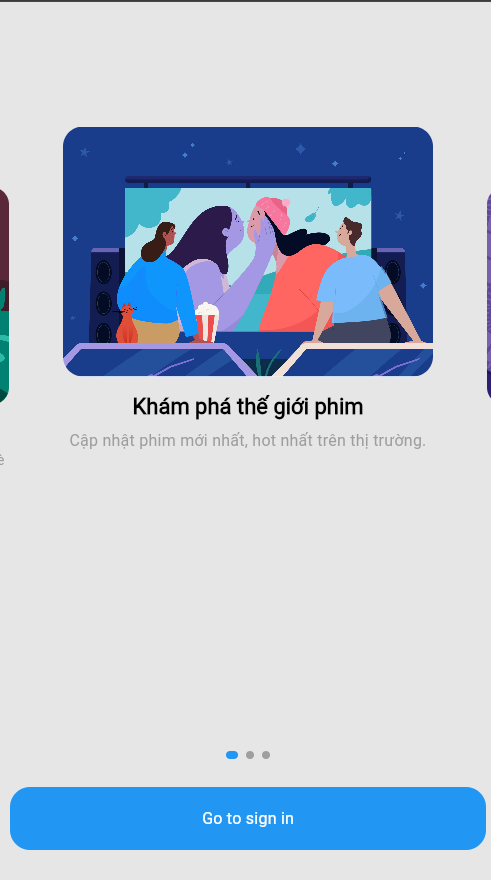 | 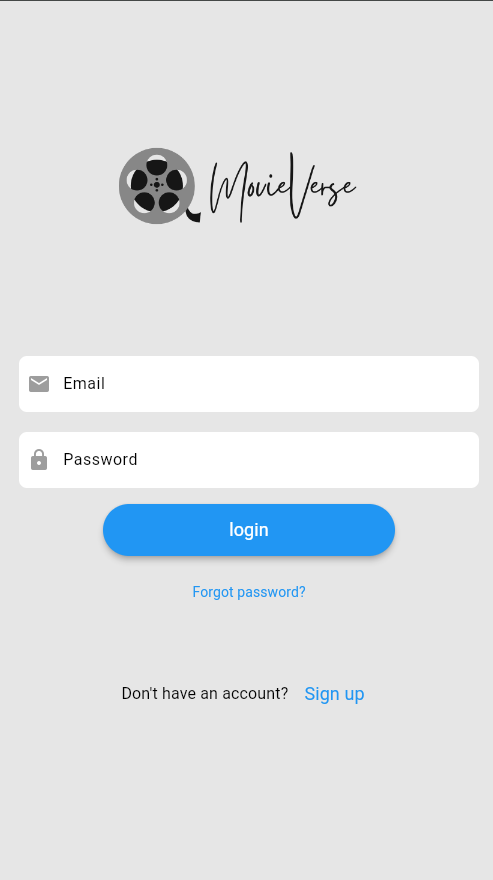
Signup Screen | Home Screen | Movie detail Screen |
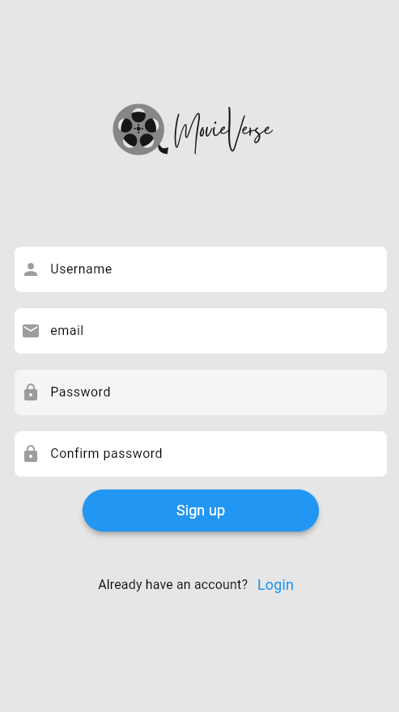 | 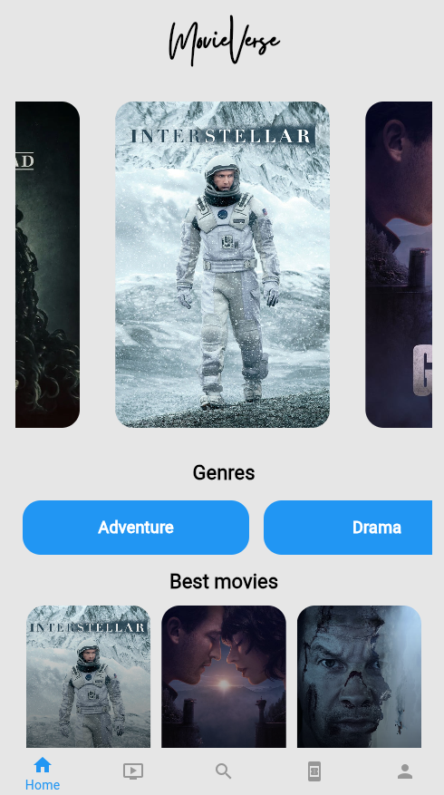 | 
Ticket Screen | Checking Screen | billing Screen |
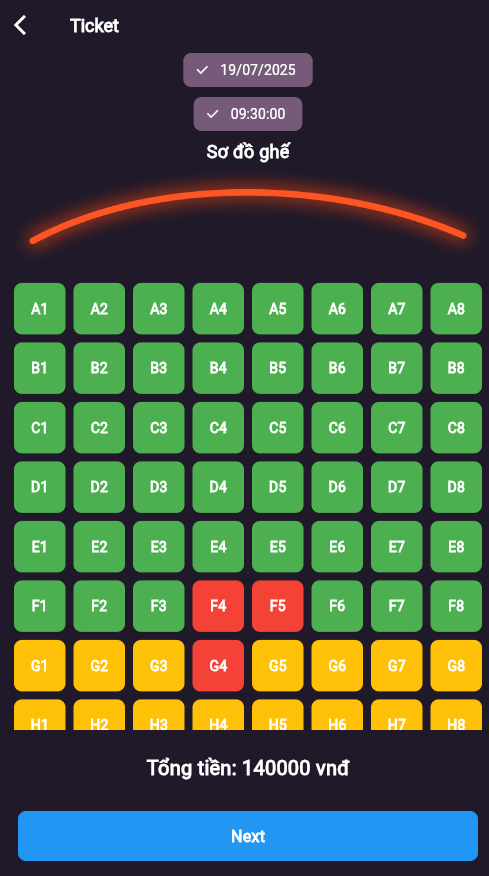 | 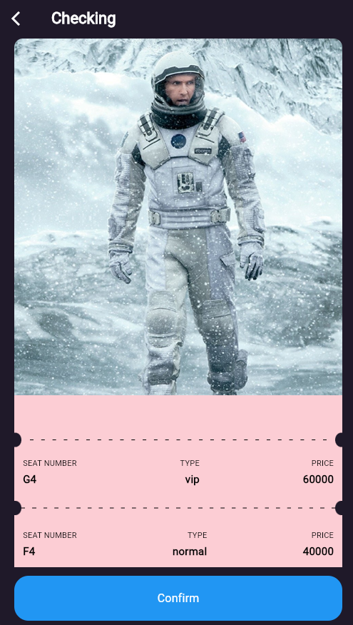 | 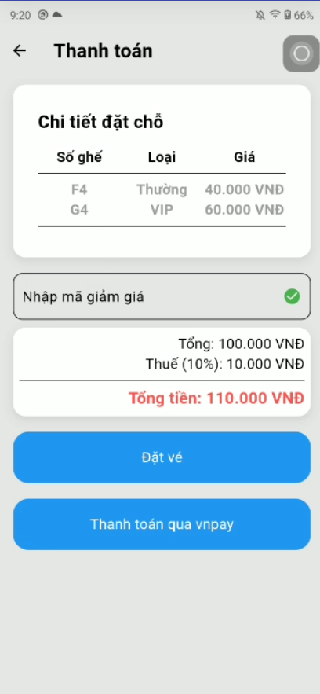
Payment vnpay Screen | Confirmation Screen | onshowing Screen |
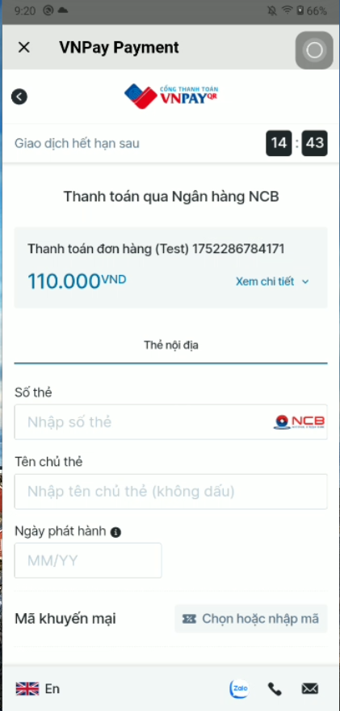 | 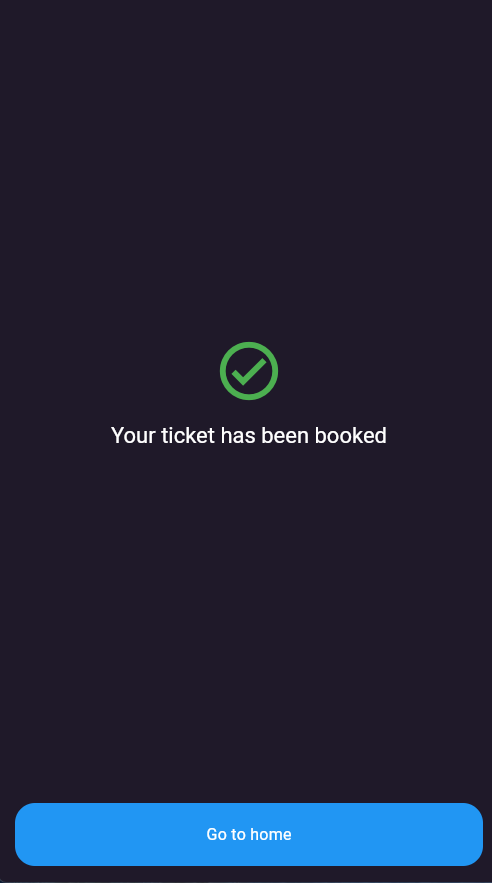 | 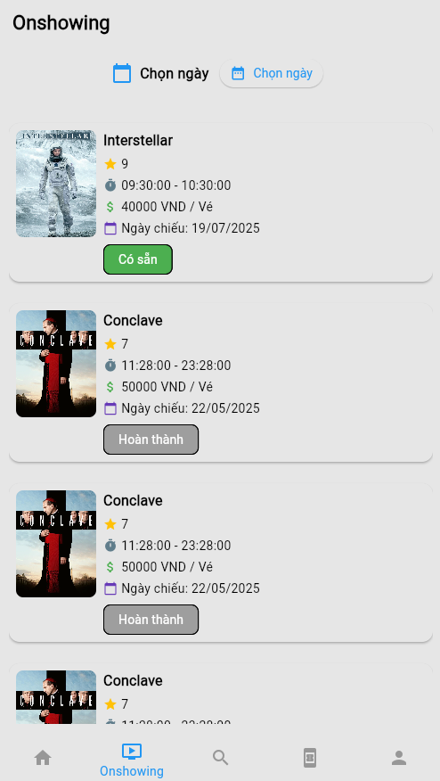
Search Screen | Bookings History Screen | Booking Details Screen |
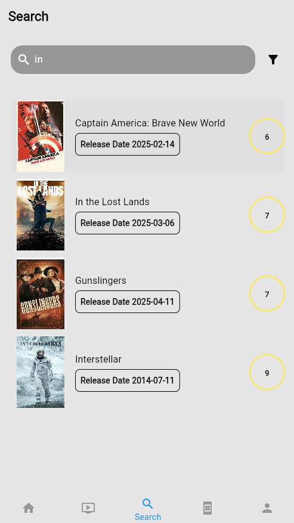 | 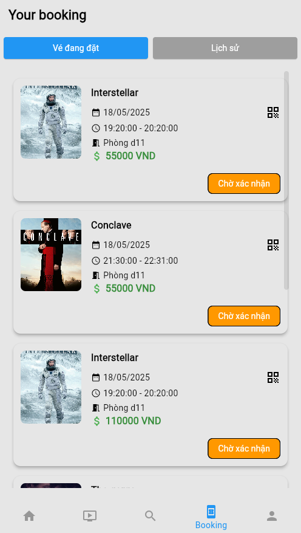 | 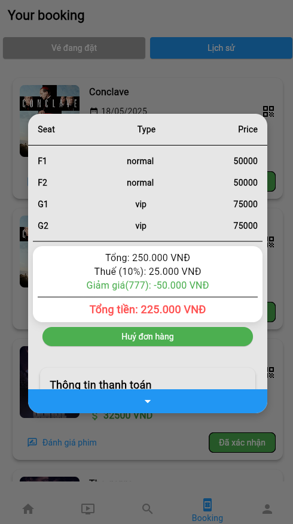
Profile Screen | Management Screen | Qr Screen |
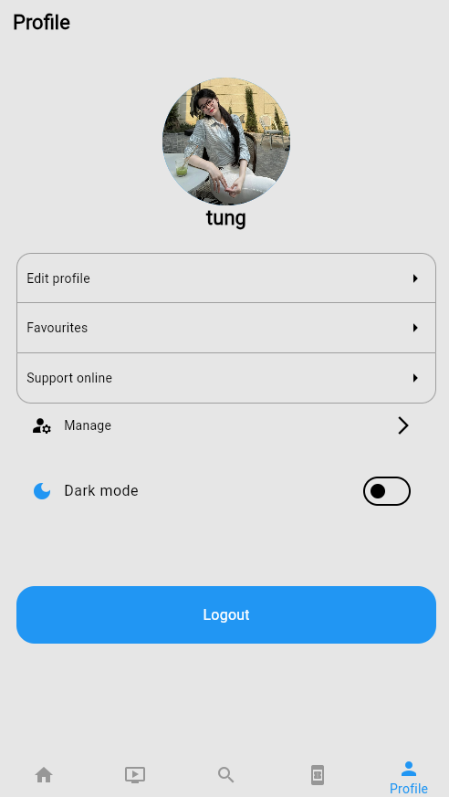 | 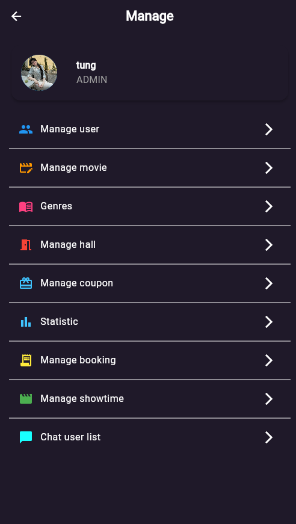 | 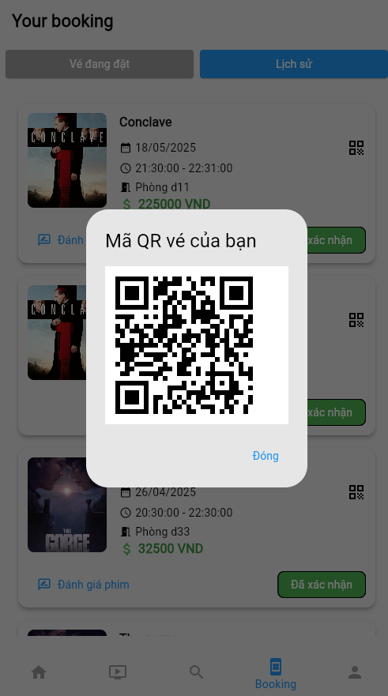
Forgot Password Screen | Support online Screen | Darkmode |
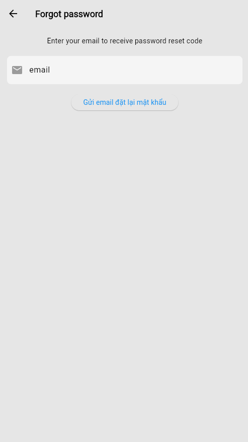 | 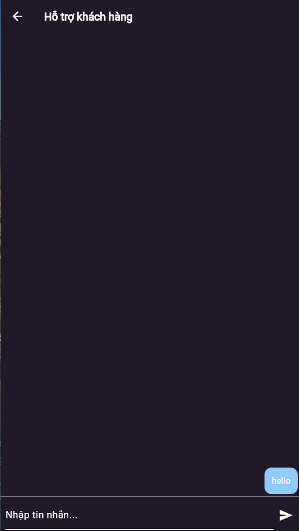 | 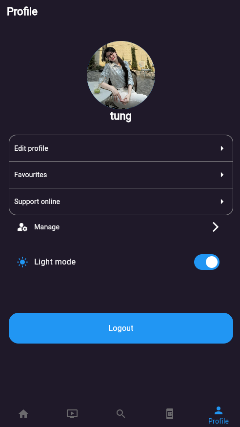
 # Chạy ứng dụng
    Tải file app-release.apk để chạy chương trình trên máy android
 # Cài đặt dependencies
    - flutter clean 
    - flutter pub get
 # Chạy chương trình
    - di chuyển tới thư mục lib chọn main.dart
    - sau đó sử dụng terminal ghi flutter run (chạy chương trình)
 # Cập nhật Supabase
    -Cấu hình các apiKeys, anonkeys, vnpay tại tại D:\movie-app2\.env hoặc D:\movie-app2\assets\.env

## Demo Tài khoản đăng nhập

| Vai trò | Email                      | Mật khẩu    |
|-------- |----------------------------|-------------|
| Admin   | tung@gmail.com             | 123456      |
| Staff   | hanoi@gmail.com            | 123456      |
| Khách   | jacknguyxn1509@gmail.com   | 123456      |

## Kiểm tra Quên mật khẩu
    - Vui lòng sử dụng email thật để nhận email từ app
